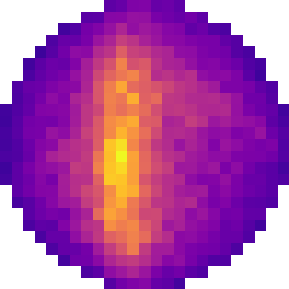

# fringe  

> Radio interferometer simulator producing **time-domain antenna signals** for FFTT and interferometric signal-processing pipelines.

#
**fringe** is a radio interferometer simulator that generates **complex time-domain voltage samples per antenna**, rather than visibilities.

Unlike most existing simulators, fringe is designed specifically for **FFTT imaging and calibration pipelines**, where the time domain signals are required. Instead of correlating signals internally, the simulator produces synchronized complex sample windows for every antenna, allowing downstream software to perform correlation, beamforming, calibration, or FFTT imaging as required.

The project is implemented in Rust and can be used as:

- a standalone command-line application
- a Rust library
- a native Python module

Both CPU and GPU execution are supported, with the runtime selected dynamically.

---

## Scientific Background

fringe was developed as part of a Master's thesis.

The accompanying thesis (`thesis.pdf`) describes

- the context this project was developed for
- the signal generation approach
- implementation details
- validation methodology
- performance considerations

The appendix includes verification results in which simulated antenna signals
generated by fringe were converted into visibilities and imaged using WSClean.
The resulting images were compared against an equivalent Sagecal/WSClean
simulation pipeline, demonstrating agreement between the two approaches.

## Features

- Generate complex time-domain samples for every antenna
- Designed specifically for FFTT imaging pipelines
- Large-N array support
- Large point-source sky models with power-law spectra
- Calibrators: SDR-style transmitters playing cyclic IQ buffers from moving positions, including Doppler
- CPU runtime (multi-threaded)
- Cross-platform GPU runtime (using `wgpu`)
- Executable with command-line interface 
- Native Python module (using `PyO3`)

## Architecture

The project consists of three interfaces built from the same Rust codebase.

| Target | Description |
|---------|-------------|
| CLI | Standalone executable |
| Python module | Native extension built with PyO3 |
| Rust library | For integration into Rust projects |

The simulation backend is shared between all three.

## Web frontend

[fringe-frontend](https://github.com/samvandenende/fringe-frontend) is a separate (experimental) browser-based
environment built on the Rust library. It can be used to

- configure the array, sky model and calibrator, and load or export them in fringe's file formats
- run simulations on the CPU or GPU runtime
- inspect the time-domain antenna samples, spectra and waterfalls
- form beamformed sky images and compare them against the analytic expectation

---

## Calibrators

A calibrator is a known emitter, such as a satellite, used to calibrate the array. Each calibrator has a `Transmitter`, configured like a software defined radio:

| Parameter | Meaning |
|---|---|
| `frequency` | Carrier frequency (Hz) |
| `sample_rate` | Rate at which the buffer is played out (Hz) |
| `power` | Radiated power (W) for a buffer with unit RMS; buffer samples are relative levels |
| `buffer` | Complex baseband samples, transmitted cyclically |
| `bandwidth` | Optional reconstruction filter bandwidth (Hz) |
| `start_time` | Time (s) at which the first buffer sample is transmitted |

The calibrator moves with constant acceleration from its `position` and `velocity` at `epoch`. The received signal is computed from the exact light-time delay to every antenna, so it includes carrier and code Doppler. Signals of consecutive sample windows are continuous in time.

```python
transmitter = fr.Transmitter(frequency=75e6, sample_rate=50e6, power=10.0, buffer=iq)
calibrator = fr.Calibrator(position, transmitter, velocity=velocity, acceleration=acceleration)
sim.set_calibrators([calibrator])
sim.start(time=0.0)  # later calls to sim.start() continue where the previous window ended
```

Calibrators are saved with `save_calibrators` as a JSON list, with each transmit buffer in a raw interleaved little-endian 32-bit float IQ file (`cf32_le`) next to it.

Calibrator signals are filtered by the array's bandpass like the sky. Near the band edges this filter is softened over about `sample_frequency / ((frequency_resolution - 1) * sample_window_size / 2)` Hz.

---

## Execution backends

Fringe supports two execution backends:

- CPU
- GPU

The CPU backend distributes work over multiple threads, parallelizing over the number of antennas in the array.

The GPU backend uses

- `wgpu`
- WGSL compute shaders

The execution backend is selected at runtime, allowing the same application to execute on systems with varying operating systems with or without GPU acceleration.

---

## Repository Layout

```
fringe/
├── src/
├── examples/
├── tests/
├── thesis.pdf
├── Cargo.toml
├── fringe.pyi
├── install_python_lib.sh
└── ...
```

## Examples

The `examples/` directory contains examples of how to use fringe.

Current examples include:

- A python script which loads an example array and sky model, simulates antenna data, and creates a sky image.
- A python script which simulates a calibrator satellite in orbit, estimates its time of arrival at every antenna, and compares the accuracy to the Cramér-Rao bound.

## Tests

The `tests/` directory contains verification tests for the simulator.

Current tests include:

- Verification of CPU and GPU outputs being qualitatively identical. The outputs of both backends are compared sample-by-sample and are expected to agree upto floating-point rounding errors.

Unit tests of the library, including verification of the calibrator signal model, run with `cargo test`.

---

## Requirements

## Rust

Install Rust/Cargo using:

https://rustup.rs/

A recent stable Rust compiler is recommended. It is recommended to do the standard installation.


## Python 

Python bindings require Python 3.

The bindings are implemented using PyO3 and are built automatically through Cargo.


## GPU

GPU execution requires a graphics API supported by `wgpu`, such as:

- Vulkan
- Metal
- DirectX 12
- OpenGL (where supported)

If no compatible GPU is available, the CPU backend can always be used.

---

## Cloning

Clone the repository:

```bash
git clone https://github.com/samvandenende/fringe.git
cd fringe
```

## Installing the CLI

Build and install the executable:

```bash
cargo install --path .
```

## Installing the Python Module

The repository includes a helper script:

```bash
./install_python_lib.sh
```

The script will:

1. build the Python module in release mode
2. locate your local Python site-packages directory
3. install the compiled library and `fringe.pyi` stubs

After installation:

```python
import fringe
```

works like any other Python package.

---

## Platform Support

| Platform | Status |
|----------|--------|
| Linux | Tested |
| Windows | Expected to work (untested) |
| macOS | Expected to work (untested) |

---

## Intended Applications

Fringe is intended for:

- FFT Telescope calibration research
- Radio interferometer algorithm development

## Citation

If you use `fringe` in research work, consider citing the thesis or project repository.
